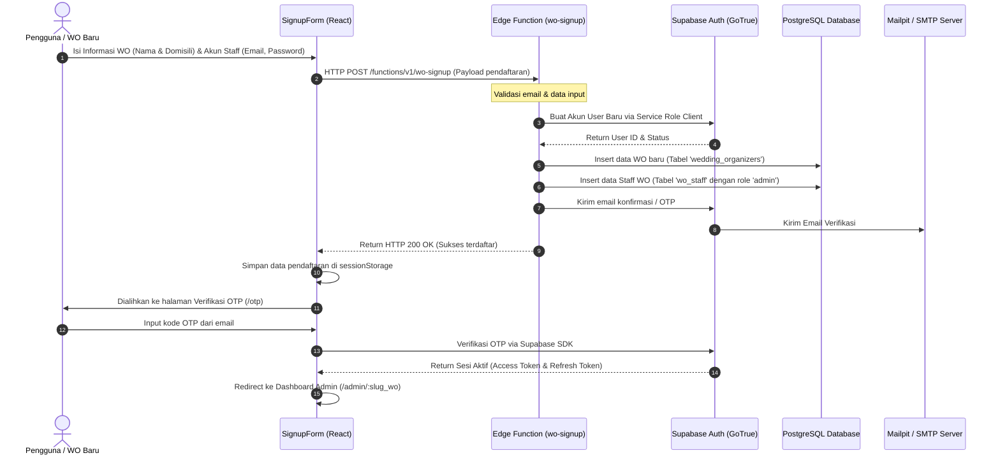

# 🚀 Flow Onboarding & Pendaftaran (Signup)

Dokumen ini menjelaskan alur kerja pendaftaran Wedding Organizer (WO) baru hingga pengguna berhasil masuk ke dalam sistem.

## 📊 Diagram Alur Pendaftaran

## 📝 Penjelasan Detail Langkah:

1. **Input Data**: Pengguna mengisi formulir pendaftaran 2-langkah di halaman `/signup`:
   * **Langkah 1**: Nama Wedding Organizer dan Domisili.
   * **Langkah 2**: Nama lengkap Staff Utama, Email, dan Kata Sandi.
2. **Pengiriman Data**: Form mengirim request ke Edge Function `wo-signup` di Supabase untuk menjaga kerahasiaan `service_role_key` selama proses penulisan terstruktur ke database.
3. **Pembuatan User Auth**: Edge Function mendaftarkan user baru di sistem autentikasi Supabase.
4. **Pembuatan Entitas WO**: System memasukkan entri organisasi baru ke tabel `wedding_organizers` untuk mendapatkan `wo_id`.
5. **Pembuatan Akun Staff**: Menghubungkan ID user auth dengan `wo_id` baru di tabel `wo_staff` dengan jabatan `admin`.
6. **Kirim Email Konfirmasi**: Supabase Auth mengirimkan token verifikasi (OTP) ke alamat email pendaftar.
7. **Verifikasi OTP**: Pengguna memasukkan OTP di halaman `/otp`. Setelah divalidasi oleh Supabase, token sesi dibuat dan pengguna dialihkan ke halaman dashboard admin.
