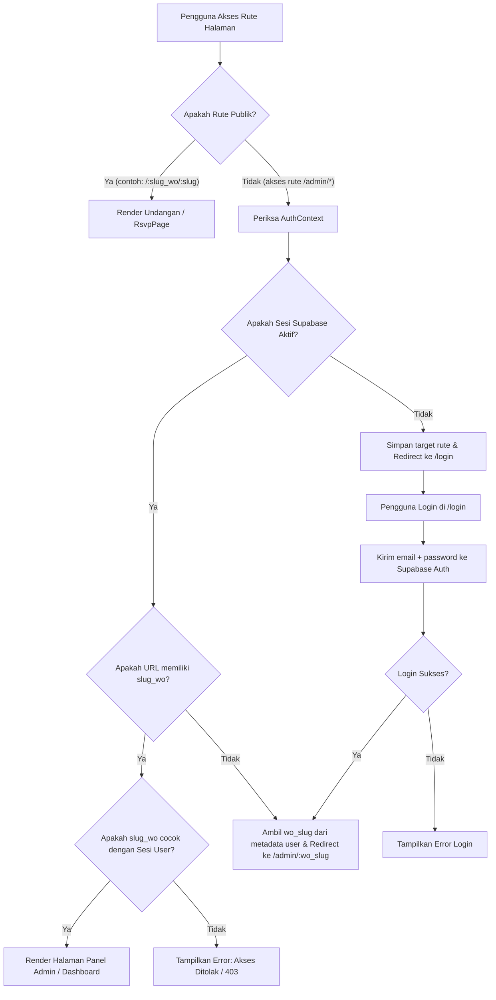

# 🔐 Flow Autentikasi & Proteksi Rute (Session Management)

Dokumen ini menjelaskan bagaimana status autentikasi dipertahankan dan bagaimana sistem memproteksi halaman admin menggunakan session state.

## 📊 Diagram Alur Autentikasi

## 📝 Penjelasan Detail Langkah:

1. **Auth Context Provider (`AuthContext.tsx`)**:
   * Melakukan inisialisasi awal dengan memanggil `supabase.auth.getSession()`.
   * Mendengarkan perubahan sesi secara real-time via `supabase.auth.onAuthStateChange()`.
   * Menyediakan state `user`, `session`, `loading`, dan `signOut` ke seluruh komponen anak.
2. **Proteksi Halaman (`AdminLayout.tsx` & `DashboardPage.tsx`)**:
   * Menggunakan status dari `AuthContext` untuk memverifikasi apakah token JWT aktif.
   * Jika tidak ada sesi, pengguna otomatis dikembalikan ke halaman `/login`.
3. **Mekanisme Tenant Binding**:
   * Setiap akun staff terikat pada satu Wedding Organizer tertentu (`wo_id`).
   * Detail `wo_slug` disimpan dalam metadata pengguna Supabase Auth, sehingga memudahkan pengalihan rute dinamis dari `/admin` ke `/admin/:slug_wo`.
