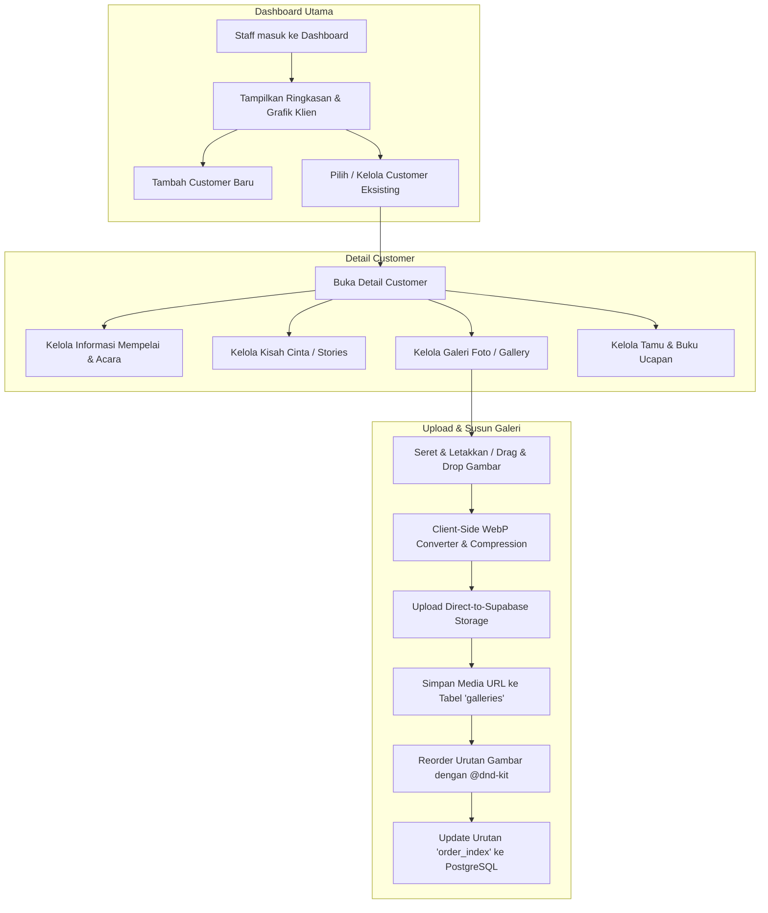

# ⚙️ Flow Panel Admin & Manajemen Klien (CRUD)

Dokumen ini menjelaskan alur kerja pengelolaan data pengantin (customer), kisah cinta (stories), serta pengelolaan media (gallery) menggunakan drag-and-drop.

## 📊 Diagram Alur Manajemen Admin

## 📝 Penjelasan Detail Langkah:

1. **Tambah Customer**: Staff WO membuat data klien pernikahan baru. Data ini otomatis tersimpan ke tabel `customers` dan berelasi dengan `wo_id` milik staff yang sedang aktif (dijamin oleh RLS).
2. **Manajemen Acara & Akad/Resepsi**: Form ini memperbarui informasi tanggal, waktu, lokasi peta (*embed map*), dan detail kontak pasangan mempelai.
3. **Pengunggahan Foto Galeri**:
   * Sistem menghindari pengunggahan gambar mentah berukuran besar.
   * Gambar dikonversi ke format **WebP** di sisi klien untuk meminimalkan ukuran file tanpa menurunkan kualitas visual secara drastis.
   * File diunggah langsung ke bucket Supabase Storage, lalu URL publiknya disimpan di tabel `galleries`.
4. **Pengurutan Menggunakan Drag & Drop**:
   * Pengurutan kisah cinta (`stories`) dan foto galeri (`galleries`) menggunakan `@dnd-kit/sortable` untuk pengalaman visual yang interaktif.
   * Posisi urutan baru diperbarui langsung di database dengan mengubah kolom integer `order_index`.
