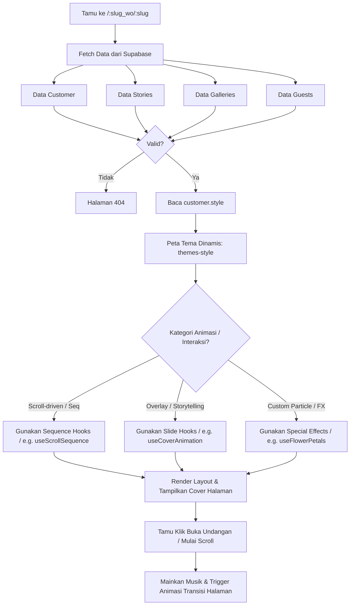

# 🎨 Flow Rendering Undangan Publik (Dynamic Theme Dispatch)

Dokumen ini menjelaskan bagaimana sistem mengambil data dan merender halaman undangan publik bertema secara dinamis ketika dikunjungi oleh tamu.

## 📊 Diagram Alur Rendering Undangan

## 📝 Penjelasan Detail Langkah:

1. **Resolusi Rute Publik**: Rute publik menggunakan pola `/:slug_wo/:slug`. Hal ini memungkinkan filter query pencarian data customer tetap unik berdasarkan slug customer dan slug organisasi WO induknya.
2. **Pengambilan Data Tanpa Autentikasi (Public Access)**: Query data dilakukan menggunakan klien anonim Supabase (`VITE_SUPABASE_ANON_KEY`). Hak akses baca publik ini diizinkan oleh kebijakan PostgreSQL RLS pada tabel terkait.
3. **Dynamic Theme Dispatching (`InvitationPage.tsx`)**:
   * Sistem membaca atribut gaya/tema (`customer.style` atau `invitation.style`).
   * Aplikasi mencocokkan nilainya pada registry tema (`resources/js/themes/`). Hal ini mempermudah penambahan puluhan tema baru di masa depan secara dinamis tanpa mengubah logika routing utama.
4. **Triggering GSAP & Custom Animation Hooks**:
   * Setiap modul tema mengekspos gaya visual dan hook animasinya sendiri secara terisolasi.
   * **Gaya Berbasis Scroll**: Menggunakan sequence gambar dan canvas pinning (misalnya hook `useScrollSequence`).
   * **Gaya Berbasis Slide/Overlay**: Menggunakan transisi sampul naik-turun atau geser samping (misalnya hook `useCoverAnimation` & `useScrollReveal`).
   * **Gaya Efek Partikel**: Menyediakan efek interaktif seperti kelopak bunga jasmine gugur (misalnya hook `useFlowerPetals`).
5. **Aktivasi Interaksi**: Setelah tamu mengeklik tombol pembuka undangan, background audio (musik) akan diputar secara otomatis dan scroll konten utama dibuka.
