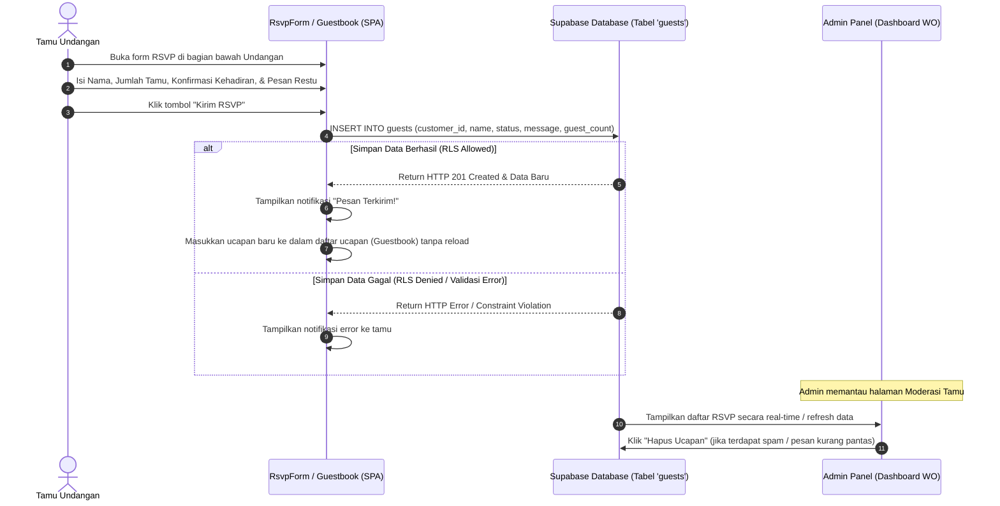

# 💬 Flow RSVP & Buku Ucapan (Guestbook)

Dokumen ini menjelaskan bagaimana interaksi tamu undangan mengirimkan RSVP dan ucapan restu yang akan langsung masuk ke database dan dapat dimoderasi oleh admin.

## 📊 Diagram Alur RSVP & Ucapan

## 📝 Penjelasan Detail Langkah:

1. **Input RSVP**: Tamu mengisi data konfirmasi kehadiran di komponen `RsvpForm` yang disematkan di halaman undangan pernikahan.
2. **Mutasi Database Langsung**:
   * Sisi klien melakukan query insert langsung ke tabel `guests` menggunakan Supabase Client SDK.
   * Supabase mengevaluasi kebijakan RLS untuk tabel `guests`. Kebijakan ini mengizinkan operasi *insert* secara anonim (publik) asalkan data berelasi dengan ID customer yang valid.
3. **Pembaruan Antarmuka Tanpa Memuat Ulang (Reactive Update)**:
   * Setelah data sukses tersimpan di database, list ucapan di komponen `Guestbook` diperbarui secara reaktif menggunakan local React state, menampilkan ucapan terbaru di bagian atas daftar.
4. **Moderasi oleh Admin**:
   * Administrator/Wedding Organizer memiliki akses penuh di dashboard admin untuk melihat rangkuman tamu yang hadir, jumlah orang yang akan datang (untuk estimasi katering), dan menghapus pesan ucapan jika dianggap mengandung spam.
